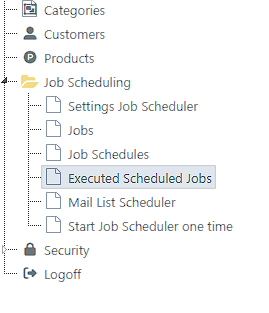
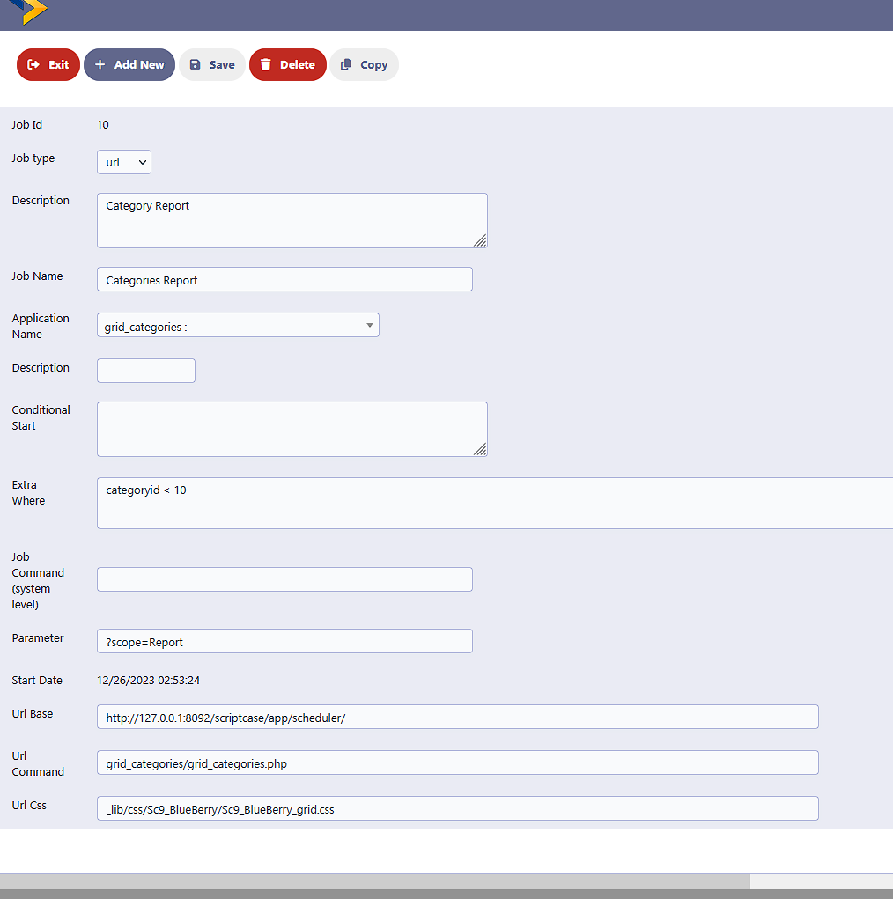
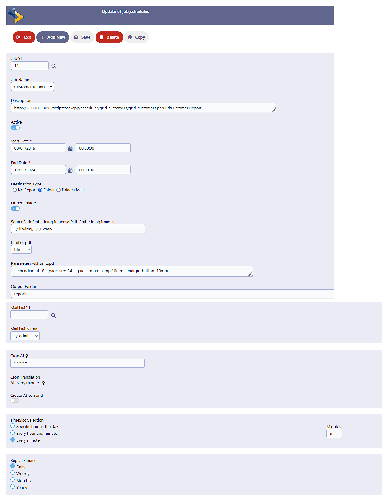
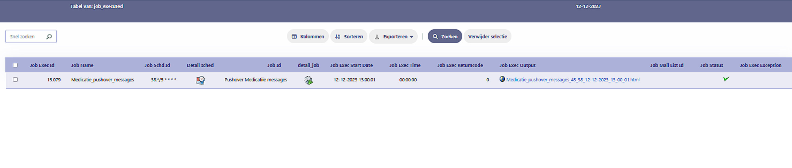

**Scriptcase Scheduler**

Scheduler for Scriptcase grid reports (in HTML or PDF format) where the results are stored or can be sent by mail automatically.

**Features:**

    - Schedule any grid report with minimal modifications.
    - Create a job, schedule it, and find the result in the Job Executed overview.
    - Tested on Scriptcase version 9.10.0002 and PHP version 8.1.6 and mysql 5.7.29 (Not tested on older versions).
    - Jobs: Create an additional WHERE clause.
    - Schedule: Select a period during which the schedule is active, embed images, and send it to a mailing list.

Date: 27–12–2023   Updated: 29-1-2024

**Introduction**

I developed this project to address the need for scheduling, allowing me to send reports to users or schedule tasks while keeping all development centrally within Scriptcase. The reports that are created combine all html elements in one file (pdf or html) to be able to be send via mail (it is using emogrifier)

It's essential to note that this scheduler only functions when the security is turned off for the respective grid you intend to schedule. Therefore, it should not be published in the standard production environment. I utilize Docker to create a separate instance where only the system, via crontab, can access these unprotected applications while being connected to the same database. Another option is to set up an extra protected environment for enhanced security. This is not an easy project to implement and requires insight in security risks when you want this published in production.

**Warning: Do not expose unprotected applications on the web!**

I use the crontab scheduler on Ubuntu Linux. For other environments, you will need to find alternatives to crontab (e.g., Task Scheduler on Windows).

I've provided a working functional setup based on Scriptcase's security example application, scheduling reports based on categories, products, and customers. 
It is running with MySQL.

**Installation Steps:**

1. Import this File in MYSQL (Download [https://deam-scriptcase.s3.eu-west-1.amazonaws.com/schedulerexample/scheduler.sql])   (now links work!)
2. Import within scriptcase development environment this backup. (download [https://deam-scriptcase.s3.eu-west-1.amazonaws.com/schedulerexample/sc9_202401291602_export_Scheduler3.zip])
3. Unpack scheduler_libraries in a temporary folder. (download [https://deam-scriptcase.s3.eu-west-1.amazonaws.com/schedulerexample/scheduler_libraries.zip])
As I can not test this procedure please inform me if it works. Copy the subfolder to your development without overwriting.
In my case the information is in location C:\Program Files\NetMake\v9-php81\wwwroot\scriptcase\app\Scheduler\_lib\libraries
Enable every library in development (
4. Connect to the right database (scheduler)
5. Generate every application
6. Test the applications by executing 'running Start Job Scheduler one time' within menu Scheduler.
Check if the output is found in overview 'Executed Scheduled Jobs'
7. In Production On Ubuntu Linux in crontab make an entry (crontab -e) with this line: (ensure you change 172.20.0.11 and use the right ip addres for this )
On windows you have to use taskmanager (not tested yet)
<pre>
*/5 * * * * sudo -u daemon /usr/bin/curl 'http://172.20.0.11/blank_job_scheduler/blank_job_scheduler.php?scope=Report&client_id=0oa10XXXXMZhouRW357' 2>&1 | logger  -t 'blank_job_scheduler'
</pre>
( every 5 minutes the scheduler checks if programs should be started. In this case you can not have a tasks scheduled at 12:01 but only right at the 5 minutes interval).

**Making Your Grid available for scheduling**

If have made the grids like grid_categories available for scheduling by changing the following:
<pre>
    1. Switch off security 
    2. Add to Events onApplicationInit:    init_scheduled_full_report();
    3. Add to events onScriptInit:         init_scheduled_report();
    4. Make internal libraries all available (In Programming internal libraries)
    5. Generate applications
</pre>

**Functionality:**

**Menu**

**Add Job**

**Add Job Schedule**

**Executed Scheduled Jobs**

**Settings Job Scheduler**
Please go through the list and change all the settings where set Parameter starts with sc_api and Set Value mentions CHANGETHIS

**Mail List Scheduler**

**Start Job Scheduler one time**
For testing purposes

**Encountering problems ?**
Check the following
- Is your ip address correct
- Is Job_schedule active or begin and end date correct
- Security off and added the right functions
- Are the rights correct set for the programs to write the reports

**Many Thanks to all opensource contribitors on github like**

    Peppeocchi for php-cron-scheduler
    Sivaschenko for cron-utility
    Pelago for emogrifier
    
    
    

